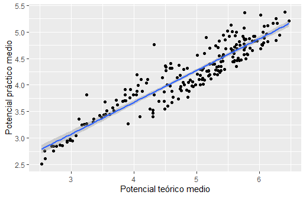
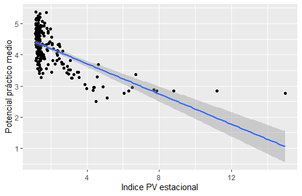
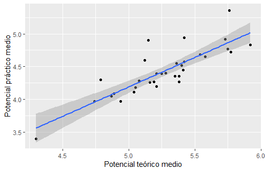
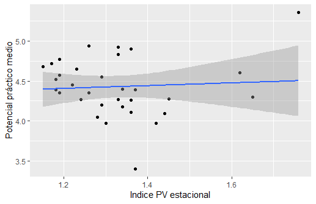
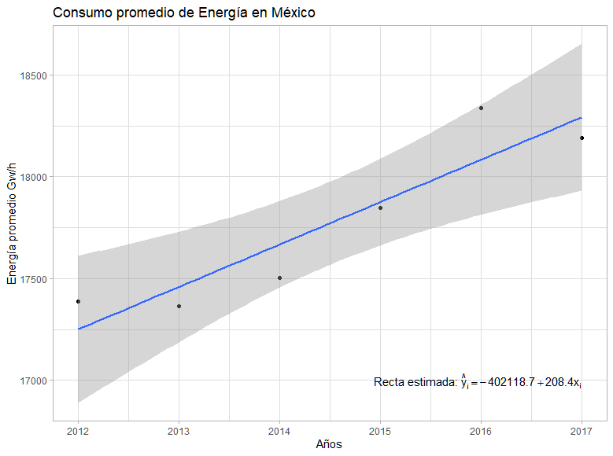

# Curso BEDU-Santander DS: Trabajo Equipo 2

## Proyecto: Generación de energía en México: alternativas limpias.

La producción de energía eléctrica es una de las principales actividades emisoras de CO2.

Es por ello que la búsqueda de alternativas sostenibles para su generación es de vital importancia.

Dada la trascendencia de este tema, nos dimos a la tarea de plantear el presente proyecto.

### Hipótesis: 
México tiene un gran potencial para la generación de energía limpia y puede emprender un cambio sustentable en materia energética.

### Pregunta de investigación:
¿Qué tan viable es la generación de energía menos contaminante en México?

### Equipo 2: 
- Atenea De La Cruz Brito
- Zoé Ariel García Martínez 
- Gerardo Miguel Pérez Solis 


Primero se realizó la descarga de los dataset principales de la siguiente página: https://maps.nrel.gov/rede-mexico/

Se tomaron los archivos .dbf y se transformaron en archivos .csv:

```r
library(foreign)

#Directorio de trabajo
setwd("Aqui va la direccion")

# Extracción de datos .dbf y transformación a .csv
i_gen <- read.dbf("/mx_inventory_gen_new/mx_inventory_gen_new.dbf")
i_pot <- read.dbf("/mx_inventory_pot_new/mx_inventory_pot_new.dbf")
i_dni <- read.dbf("/nsrdb_mx_dni_new/nsrdb_mx_dni_new.dbf")

write.csv(i_gen,"mx_inventory_gen_new.csv",row.names = F)
write.csv(i_pot,"mx_inventory_pot_new.csv",row.names = F)
write.csv(i_dni,"nsrdb_mx_dni_new.csv",row.names = F)
```

Una vez que se tienen los .csv  se realizó la lectura de los mismos y se hacieron consultas sobre la información: 

```r
#Lectura de los datos 
gen <- read.csv("mx_inventory_gen_new.csv")
head(gen); tail(gen); names(gen); class(gen); str(gen); summary(gen)

pot <- read.csv("mx_inventory_pot_new.csv")
head(pot); tail(pot); names(pot); class(pot); str(pot); summary(pot)

dni <- read.csv("nsrdb_mx_dni_new.csv")
head(dni); tail(dni); names(dni); class(dni); str(dni); summary(dni)

rank <- read.csv("solargis_pvpot_countryrank_2020.csv")
head(rank); tail(rank); names(rank); class(rank); str(rank); summary(rank)

#Seleccionar y renombrar columnas a emplear
rank <- select(rank, iso = ISO_A3, country = Country, region = WorldBankRegion,
               theoghi = Average_theoretical_potential_GHI_kWh_m2dayLongterm,
               pracpvout = Average_practical_potential_PVOUT_Level1_kWh_kWdayLongterm,
               avlcoe = Average_economic_potential_LCOE_USD_kWh2018,
               pvpc = AveragePVseasonality_index_longterm)
head(rank); tail(rank); length(rank)

########################## II. Consulta de datos ########################################

#Cuantas veces aparece un estado en gen

unique(gen$ESTADO) # <- hay 27 estados listados

(cuentaEstado <- count(gen, ESTADO)) # <- cuento qué tantas veces se repite un estado

cuentaEstado[cuentaEstado$n == max(cuentaEstado$n), ] # <- el estado más repetido es Veracruz

cuentaEstado[cuentaEstado$n == min(cuentaEstado$n), ] # <- Colima e Hidalgo los que menos aparecen

#Análisis tipo de plantas en gen: 

unique(gen$plant_type) # <- hay 5 tipos de plantas

(cuentaPlanta <- count(gen, plant_type)) # <- enlisto los tipo de plantas

# tenemos 96 plantas de poder h?drico funcionando...


#datos con los de la BD pot

unique(pot$ESTADO) # <- 32 estados potenciales para tener plantas generadoras

(cuentaEstadoP <- count(pot, ESTADO)) #<- cuanto se repite cada estado

cuentaEstadoP[cuentaEstadoP$n == max(cuentaEstadoP$n), ] # <- el EDO que aparece m?s veces es jal?sco

cuentaEstadoP[cuentaEstadoP$n == min(cuentaEstadoP$n), ] #el EDO que aparece menos es Tlaxcala

#plantas que se tienen listadas en pot: 

unique(pot$plant_type) # <- hay 5 tipos de plantas

(cuentaPlantaP <- count(pot, plant_type)) # <- cuanto se repiten tipo de plantas

#la planta en pot que se repite más veces es la geot?rmica con 1089 veces.
```

A continuación se realizó un análisis exploratorio donde se obtuvieron diferentes gráficos, para estudiar el promedio teórico, práctico y económico del PV mundial, la generación en $GW/h$ por ubicación geográfica y por tipo de planta, así como el potencial energético en $GW/h$ dada la ubicación geográfica y tipo de planta.


Entre las gráficas realizadas se encuentran las siguientes:

<p align="center">
  
</p>

<p align="center">
  
</p>

<p align="center">
  
</p>


Posteriormente se realizaron diferentes modelos de relaciones con el dataset de rank, se obtuvieron los siguientes resultados, que muestran la correlación y la tendencia entre los datos de interés.


<p align="center">
  
</p>

Resultado: relación positiva, potencial de generación de energía teórico y práctico se relacionan.

<p align="center">
  
</p>

Resultado: relación negativa, a menor variabilidad entre estaciones del año, mayor potencial práctico.

Ahora solo con países de America Latina y el Caribe:

<p align="center">
  
</p>

Resultado: relación positiva

<p align="center">
  
</p>

Resultado: sin relación aparente

Enseguida, se realizaron gráficas para conocer la relación entre la generación eléctrica por tipo de planta, para conocer cuál es la planta con mayor desempeño actual, como también se realizaron gráficas de barra para conocer la generación de energía debido a estas plantas por estado, de igual forma se graficaron tanto el potencial promedio por tipo de planta, para evaluar su desempeño, así como el potencial promedio que tiene cada estado de la república para generar energía. 

A continuación se enlistan los resultados gráficos:

<p align="center">
  
</p>

<p align="center">
  
</p>

<p align="center">
  
</p>

<p align="center">
  
</p>

Por último se decidió realizar un análisis del consumo de energía por entidad federativa con datos del SIE  (http://sie.energia.gob.mx/bdiController.do?action=cuadro&cvecua=DIIE_C32_ESP), con el propósito de conocer el panorama actual del consumo energético por entidad federativa y estudiar si es factible usar plantas de energías para resolver el abasto de energía en la republica mexicana.

Así, se construyeron series de tiempo para cada entidad con información de Enero de 2012 hasta Diciembre de 2017, que se pueden consultar en siguiente apartado del repositorio: https://github.com/AteneaCB/Equipo2/tree/main/Zoe_aport/imghttps://github.com/AteneaCB/Equipo2/tree/main/Zoe_aport/img

Es importante mencionar el análisis que se realizó para el consumo total de la república en GW/h, con respecto al tiempo, en el mismo periodo de años: 

<p align="center">
  
</p>

Esta gráfica es representativa de que el consumo eléctrico de la república, en general, está aumentando de manera anual, por lo que surge la necesidad de encontrar fuentes que puedan abastecer la exigencia energética del país.

También se realizó un análisis del consumo energético promedio a través de los años para las entidades de la república mexicana: 

<p align="center">
  
</p>
