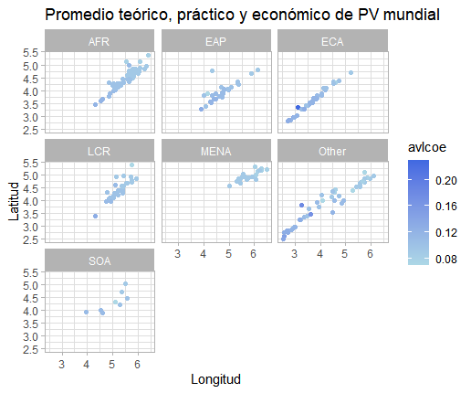

# Curso BEDU-Santander DS: Trabajo Equipo 2

## Proyecto: Generación de energía en México: alternativas limpias.

La producción de energía eléctrica es una de las principales actividades emisoras de CO2.

Es por ello que la búsqueda de alternativas sostenibles para su generación es de vital importancia.

Dada la importancia de este tema, nos dimos a la tarea de plantear el presente proyecto.

### Hipótesis: 
México tiene un gran potencial para la generación de energía limpia y puede emprender un cambio sustentable en materia energética.

### Pregunta de investigación:
¿Qué tan viable es la generación de energía menos contaminante en México?

### Equipo 2: 
- Atenea De La Cruz Brito
- Zoé Ariel García Martínez 
- Gerardo Miguel Pérez Solis 


Primero se realizó la descarga de los dataset principales de la siguiente página: https://maps.nrel.gov/rede-mexico/

Se tomaron los archivos .dbf y se transformaron en archivos .csv:

```r
library(foreign)

#Directorio de trabajo
setwd("Aqui va la direccion")

# Extracción de datos .dbf y transformación a .csv
i_gen <- read.dbf("/mx_inventory_gen_new/mx_inventory_gen_new.dbf")
i_pot <- read.dbf("/mx_inventory_pot_new/mx_inventory_pot_new.dbf")
i_dni <- read.dbf("/nsrdb_mx_dni_new/nsrdb_mx_dni_new.dbf")

write.csv(i_gen,"mx_inventory_gen_new.csv",row.names = F)
write.csv(i_pot,"mx_inventory_pot_new.csv",row.names = F)
write.csv(i_dni,"nsrdb_mx_dni_new.csv",row.names = F)
```

Una vez que se tienen los .csv  se realiza la lectura de los mismos y se hacen unas consultas sobre la información: 

```r
#Lectura de los datos 
gen <- read.csv("mx_inventory_gen_new.csv")
head(gen); tail(gen); names(gen); class(gen); str(gen); summary(gen)

pot <- read.csv("mx_inventory_pot_new.csv")
head(pot); tail(pot); names(pot); class(pot); str(pot); summary(pot)

dni <- read.csv("nsrdb_mx_dni_new.csv")
head(dni); tail(dni); names(dni); class(dni); str(dni); summary(dni)

rank <- read.csv("solargis_pvpot_countryrank_2020.csv")
head(rank); tail(rank); names(rank); class(rank); str(rank); summary(rank)

#Seleccionar y renombrar columnas a emplear
rank <- select(rank, iso = ISO_A3, country = Country, region = WorldBankRegion,
               theoghi = Average_theoretical_potential_GHI_kWh_m2dayLongterm,
               pracpvout = Average_practical_potential_PVOUT_Level1_kWh_kWdayLongterm,
               avlcoe = Average_economic_potential_LCOE_USD_kWh2018,
               pvpc = AveragePVseasonality_index_longterm)
head(rank); tail(rank); length(rank)

########################## II. Consulta de datos ########################################

#Cuantas veces aparece un estado en gen

unique(gen$ESTADO) # <- hay 27 estados listados

(cuentaEstado <- count(gen, ESTADO)) # <- cuento qué tantas veces se repite un estado

cuentaEstado[cuentaEstado$n == max(cuentaEstado$n), ] # <- el estado más repetido es Veracruz

cuentaEstado[cuentaEstado$n == min(cuentaEstado$n), ] # <- Colima e Hidalgo los que menos aparecen

#Análisis tipo de plantas en gen: 

unique(gen$plant_type) # <- hay 5 tipos de plantas

(cuentaPlanta <- count(gen, plant_type)) # <- enlisto los tipo de plantas

# tenemos 96 plantas de poder h?drico funcionando...


#datos con los de la BD pot

unique(pot$ESTADO) # <- 32 estados potenciales para tener plantas generadoras

(cuentaEstadoP <- count(pot, ESTADO)) #<- cuanto se repite cada estado

cuentaEstadoP[cuentaEstadoP$n == max(cuentaEstadoP$n), ] # <- el EDO que aparece m?s veces es jal?sco

cuentaEstadoP[cuentaEstadoP$n == min(cuentaEstadoP$n), ] #el EDO que aparece menos es Tlaxcala

#plantas que se tienen listadas en pot: 

unique(pot$plant_type) # <- hay 5 tipos de plantas

(cuentaPlantaP <- count(pot, plant_type)) # <- cuanto se repiten tipo de plantas

#la planta en pot que se repite más veces es la geot?rmica con 1089 veces.
```

A continuación se realizó un análisis exploratorio donde se obtuvieron diferentes gráficos, algunos de ellos fueron los siguientes:

<p align="center">
  
</p>


Posteriormente se realizaron diferentes modelos de relaciones con el dataset de rank, se obtuvieron los siguientes resultados:


Resultado: relación positiva, potencial de generación de energía teórico y práctico se relacionan.


Resultado: relación negativa, a menor variabilidad entre estaciones del año, mayor potencial práctico.

Ahora solo con países de America Latina y el Caribe:


Resultado: relación positiva


Resultado: sin relación aparente

Se quizó hacer otros gráficos relacionados al los promedios de generación y potencial de energía en GWh, los resultados fueron los siguientes:


Por último se decidió realizar un análisis del consumo de energía por entidad federativa con datos del SIE  (http://sie.energia.gob.mx/bdiController.do?action=cuadro&cvecua=DIIE_C32_ESP)

Con lo que construyeron series de tiempo para cada entidad con información de Enero de 2012 hasta Diciembre de 2017.


También se realizaron representaciones para el consumo de energía en barras y en tipo pastel: 

```R

#graficas de pastel para representar quién consume más

#creo un df conveniente para esta representación
cakeE <- lapply(tConsumoEE_sD, mean)
cakeE <- as.data.frame(cakeE)
cakeE <- cakeE[-c(1, 34, 35)]
cakeE <- t(cakeE)
cakeE <- as.data.frame(cakeE)
cakeE[,"Estado"] <- c(row.names(cakeE))
cakeE <- rename(cakeE, Consumo = V1)

#hago una columna de porcentaje: 

cakeE[,"Porcentaje"] <- (cakeE$Consumo/sum(cakeE$Consumo))*100

colorr = c("#af601a", "#273746", "#424949", "#eaeded", "#b3b6b7", "#f6ddcc",
           "#049514", "#260ea4", "#97fd18", "#bd032c", "#10f2c5",
           "#786913", "#b630b3", "#c62d58", "#1465e1", "#7c15a2", 
           "#7644f4", "#4a8ce4", "#f38f7c", "#d3b928", "#45230b",
           "#8692b4", "#f0f80c", "#b54f32", "#f3e4cf", "#7a6cfb",
           "#f553d6", "#675a02", "#dbe2d9", "#e8f73f",
           "#c15583", "#fce99a")

length(colorr); colorr[10]

pie(cakeE$Consumo)

ggplot(cakeE, mapping = aes(x = "", y= Porcentaje, fill =Estado)) +
  geom_bar(stat = "identity", color = "white") + 
  coord_polar(theta = "y") + 
  geom_text(aes(label=round(Porcentaje)),
            position=position_stack(vjust=0.5)) + 
  theme_void() +
  scale_fill_manual(values=colorr) + 
  ggtitle("Porcentaje de Consumo Eléctrico Por Entidad")

par(mar=c(11,4,4,4))
barplot(height = cakeE$Porcentaje, names = cakeE$Estado, col = "#bd032c", horiz = F, las=2,
        font.lab = 1, col.lab = "black", cex.lab = 2,
        main = "Porcentaje de Consumo Eléctrico Por Entidad") 

par(mar=c(11,4,4,4))
barplot(height = cakeE$Consumo, names = cakeE$Estado, col = "#bd032c", horiz = F, las=2,
        font.lab = 1, col.lab = "black", cex.lab = 2,
        main = "Porcentaje de Consumo Eléctrico Por Entidad GW/h") 
```

